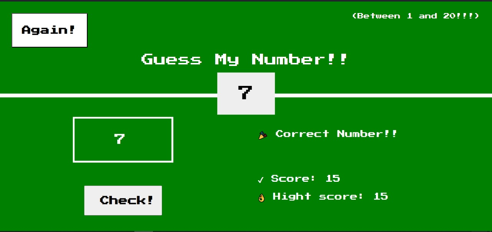

# Guess My Number

Welcome to the "Guess My Number" game! This is a simple web-based guessing game where players try to guess a randomly generated number between 1 and 20.

## How to Play

1. **Objective**: Guess the correct number between 1 and 20.
   
2. **Gameplay**:
   - Enter your guess into the input field provided.
   - Click the "Check!" button to see if your guess is correct.
   - You will receive feedback on whether your guess is too high, too low, or correct.
   - Your score will decrease with each incorrect guess.
   
3. **Winning & Losing**:
   - If you guess the correct number, you win!
   - If your score reaches 0, you lose the game.
   
4. **High Score**:
   - Your highest score achieved during the session will be displayed.
   - Try to beat your high score in subsequent rounds!
   
5. **Play Again**:
   - Click the "Again!" button to start a new game.
   - The random number and your score will reset for a fresh round of guessing.

## Screenshots



## Technologies Used

- HTML
- CSS
- JavaScript

## Installation

1. Clone the repository:
   ```bash
   git clone https://github.com/Mohda24/JavaScript-MiniGame
